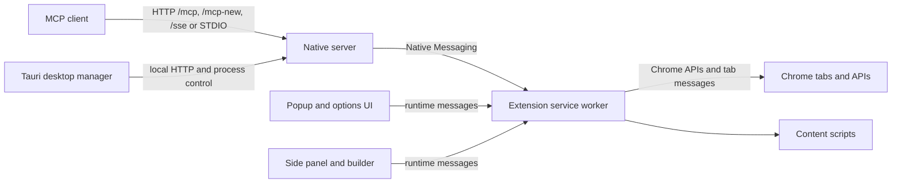
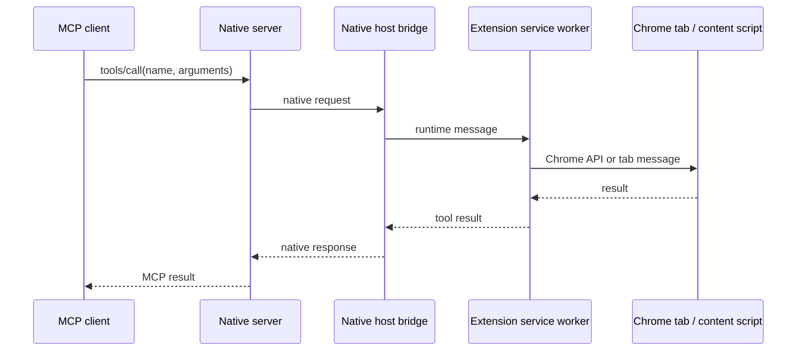

# Architecture

Chrome MCP Bridge connects an MCP client to the user's existing Chrome profile through a local service and a Manifest V3 extension. The extension owns browser access; the local Node.js process exposes the MCP transports and forwards browser tool calls over Chrome Native Messaging.

## Runtime components

### Native server (`app/native-server/`)

- `src/server/index.ts` creates the Fastify server and exposes health, status, diagnostics, and MCP routes.
- `src/mcp/` owns protocol transports, tool registration, permission filtering, and request admission.
- `src/native-messaging-host.ts` connects the local process to the extension using Chrome Native Messaging.
- `src/agent/` contains the optional local assistant, its provider engines, session services, and SQLite persistence.

### Chrome extension (`app/chrome-extension/`)

- `entrypoints/background/` is the Manifest V3 service worker. It registers runtime listeners and routes tools to browser APIs, content scripts, and page-side helpers.
- `entrypoints/`, `inject-scripts/`, and `shared/` implement page interaction and reusable UI behavior.
- `entrypoints/popup/`, `options/`, `sidepanel/`, and `builder/` provide extension interfaces; messages that need privileged browser APIs go through the service worker.
- `entrypoints/offscreen/` hosts work that needs a document context, including GIF encoding and local semantic inference.

### Shared contracts (`packages/shared/`)

`src/tools.ts` defines the canonical English browser tool schemas; `src/tools-zh.ts` keeps the Chinese descriptions the extension zh mode reads. The native server and extension consume these contracts so the MCP names and input shapes stay aligned.

### Desktop client (`app/desktop-client/`)

The Tauri + Vue client manages the local service lifecycle and presents its health and diagnostic status. It does not replace the extension: Chrome must still have the extension installed and connected.

## Browser tool request flow

The `/mcp` endpoint maintains client sessions; `/mcp-new` is stateless; `/sse` preserves the legacy transport. STDIO clients use the bridge executable, which runs the same native server and protocol implementation.

## Optional local semantic search

Semantic search is an optional extension feature. The extension stores downloaded model data in the browser Cache API and vector/index data in IndexedDB. The service worker checks for an existing model cache at startup and only initializes the inference path when a cached model exists or a semantic message arrives. Inference runs in a worker hosted by the offscreen document; model files are fetched on demand. The extension package also includes the runtime assets needed by that inference worker.

## Build and verification

- `pnpm build` builds the shared package, native server, extension, and desktop frontend.
- `pnpm run build:release` builds the Rust/WASM SIMD package and copies its generated worker files before the workspace build.
- `.github/workflows/ci.yml` runs type checking, lint, unit/integration tests, builds, and a native-server admission gate. The real Chrome smoke test is a manually dispatched acceptance job on a prepared Windows runner.

## Source map

| Concern                               | Source                                               |
| ------------------------------------- | ---------------------------------------------------- |
| MCP HTTP/SSE routes and status        | `app/native-server/src/server/`                      |
| MCP tool registration and permissions | `app/native-server/src/mcp/`                         |
| Native messaging bridge               | `app/native-server/src/native-host/`                 |
| Extension tool implementations        | `app/chrome-extension/entrypoints/background/tools/` |
| Page injection helpers                | `app/chrome-extension/inject-scripts/`               |
| Shared tool schemas                   | `packages/shared/src/tools.ts`                       |
| Desktop process integration           | `app/desktop-client/src-tauri/src/`                  |
